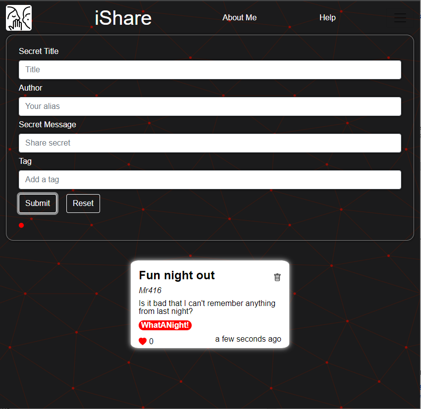

# iShare-Capston-Project

## logo

## Introduction

A simple application where people can anonymously share their thoughts and experiences or anything on their
minds, without the fear of being judged by others. Inspired by the App "Whisper" (http://whisper.sh/).

## Screen Shot

## Features

- Anonymity
- No need to register
- No need to log in

## Installation - Run locally

- Install the dependencies
- check the sample .env file; include localhost:3000, server include localhost:5000
- Run the command "npm install"
- Run the command "npm start"

## Technical stack

- MongoDB
- Express
- React
- Node.js
- Sass
- Bootstrap

## future plans

- Add a login system
- Add a profile page
- Add a share option
- Add a comment system

## demo video

- will be uploaded soon
